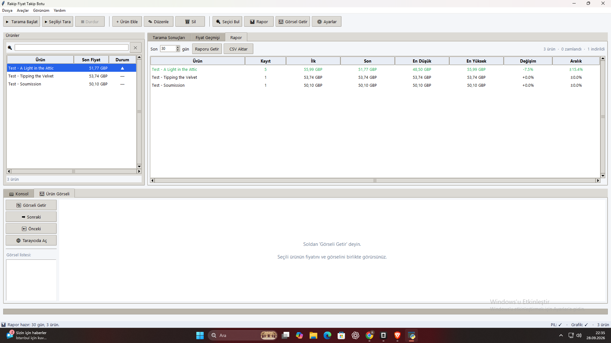
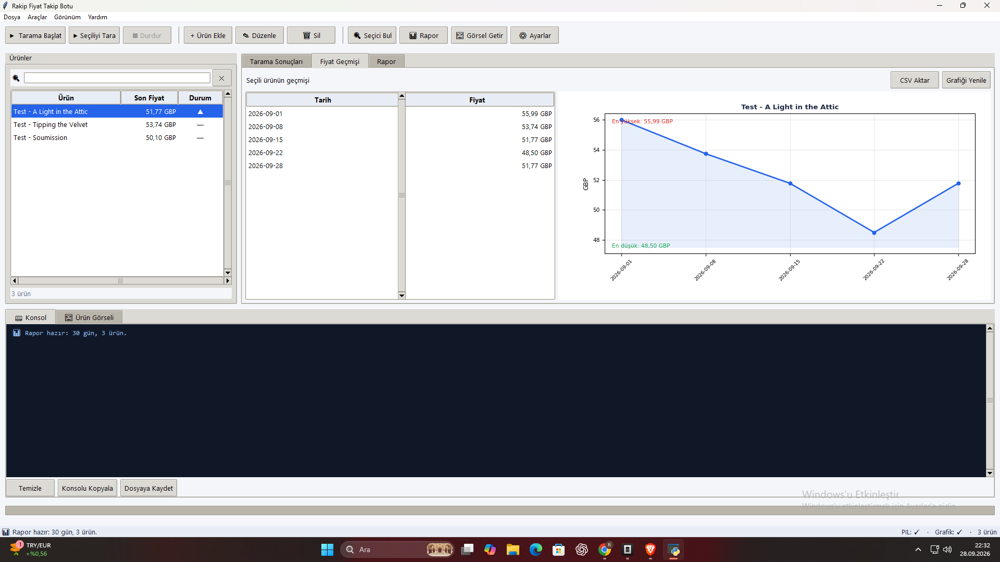

# Rakip Fiyat Takip Botu / Competitor Price Tracker

[](https://github.com/RetroNyym/rakip-fiyat-botu/actions/workflows/test.yml)
[](LICENSE)

> **Türkçe:** Rakip ürünlerin fiyatlarını otomatik takip eder, geçmişi tutar,
> fiyat değişince Telegram'dan uyarır. Masaüstü arayüzü + komut satırı.
>
> **English:** Tracks competitor product prices, keeps a price history and
> alerts you on Telegram when a price changes. Ships with a desktop GUI and
> a CLI.

---

## 🎯 Ne yapar / What it does

| | |
|---|---|
| 🔍 **Tarama** | `config.json`'daki rakip ürün sayfalarını gezer, fiyatı çeker |
| 📈 **Geçmiş** | Her günün fiyatını SQLite'a yazar → geçmiş + grafik oluşur |
| 🔔 **Uyarı** | Fiyat değişince Telegram'a mesaj atar |
| 🧭 **Seçici bul** | Fiyatın CSS seçicisini sayfadan otomatik keşfeder |
| 🖼 **Görsel** | Rakip ürününün görselini arayüzde gösterir |
| 📊 **Rapor** | En düşük / en yüksek / toplam değişim / dalgalanma aralığı |
| 📄 **CSV** | Liste, sonuç, rapor ve geçmişi Excel uyumlu CSV olarak aktarır |
| ⏰ **Otomasyon** | Görev Zamanlayıcı'ya tek tıkla günlük tarama kurar |

**Fiyat ayrıştırma** Türkçe ve uluslararası formatları ayırt eder:

```
'4.900,50 TL'              → 4900.50 TL
'200x300 halı 1.750,00 TL' → 1750.00 TL   (200 değil)
'Ürün Kodu 5544 - TL 89,90'→ 89.90 TL     (5544 değil)
'$19.99'                   → 19.99 USD
'1.234.567,89 TL'          → 1234567.89 TL
```

---

## 🖥 Ekran / Screenshots

| Arayüz | Fiyat geçmişi + grafik |
|---|---|
|  |  |

---

## 🚀 Kurulum / Installation

```bash
git clone https://github.com/RetroNyym/rakip-fiyat-botu.git
cd rakip-fiyat-botu
pip install -r requirements.txt
```

**Temel (zorunlu):** `requests`, `beautifulsoup4`
**Opsiyonel ama önerilir:** `Pillow` (görsel önizleme), `matplotlib` (grafik)

```bash
pip install Pillow matplotlib
```

Python **3.10+** gerekir.

---

## ▶ Çalıştırma / Usage

### Arayüz / GUI

```bash
python gui.py
```

Veya Windows'ta `baslat.bat` dosyasına çift tıkla.

### Komut satırı / CLI

```bash
python rakip_takip.py                  # tarama yap
python rakip_takip.py --rapor          # fiyat geçmişini göster
python rakip_takip.py --rapor --gun 90 # son 90 gün
python rakip_takip.py --inspect URL    # CSS seçici bul
python rakip_takip.py --test           # Telegram bağlantısını dene
python rakip_takip.py --config baska.json
```

### Zamanlanmış günlük tarama / Scheduled daily run

```bash
# Araçlar → Görev Zamanlayıcıya Ekle (Windows)
# veya elle: tarama.bat dosyasını Görev Zamanlayıcı'ya ekle
```

---

## ⚙️ Yapılandırma / Configuration

`config.json`:

```json
{
  "ayarlar": {
    "bekleme_saniye": 3,
    "esik_yuzde": 0,
    "telegram_token": "",
    "telegram_chat_id": ""
  },
  "urunler": [
    {
      "ad": "Rakip A - 200x300 yün halı",
      "url": "https://rakip.com/urun/yun-hali-200x300",
      "selector": "span.price",
      "not": "opsiyonel not"
    }
  ]
}
```

| Alan | Açıklama |
|---|---|
| `ad` | Ürüne verdiğin ad (raporda ve uyarıda görünür) |
| `url` | Rakip ürün sayfası |
| `selector` | Fiyatın bulunduğu CSS seçicisi. **Boş bırakırsa** bot sayfayı tarar ve para birimli ilk adayı seçer |
| `bekleme_saniye` | İstekler arası bekleme (3 önerilir) |
| `esik_yuzde` | `0` = her değişimde uyar. `5` = %5 üstü değişimlerde uyar |
| `telegram_token` | @BotFather'dan alınan bot token'ı |
| `telegram_chat_id` | @userinfobot'a yazarak aldığın chat ID |

> CSS seçicisini bilmiyorsan arayüzde `🔍 Seçici Bul` butonu sayfayı tarayıp
> aday listesi çıkarır; çift tıklayınca ürüne uygulanır.

---

## 📁 Dosya yapısı / Project structure

```
rakip-fiyat-botu/
├── gui.py            # Masaüstü arayüz (Tkinter)
├── rakip_takip.py    # Çekirdek: tarama, ayrıştırma, DB, Telegram, rapor
├── config.json       # Ayarlar + rakip ürün listesi (git'e girmez)
├── config.ornek.json # Şablon — ilk açılışta config.json buna kopyalanır
├── requirements.txt  # Çalışma bağımlılıkları
├── requirements.gelistirme.txt  # Test/CI bağımlılıkları
├── test_rakip_takip.py   # Çekirdek testleri (58 durum)
├── test_gui.py           # Arayüz duman + regresyon testleri (39 durum)
├── baslat.bat        # Arayüzü başlat (çift tık)
├── tarama.bat        # Zamanlanmış CLI taraması
├── .github/workflows/test.yml  # Her push'ta otomatik test
├── KULLANIM.md       # Türkçe kullanım kılavuzu
├── docs/             # Ekran görüntüleri
└── fiyatlar.db       # SQLite fiyat geçmişi (oluşturulur, git'e girmez)
```

---

## 🧪 Testler / Tests

Testler **ağ erişimi gerektirmez** — yerel (127.0.0.1) bir HTTP sunucusu
kurar, fiyat sayfasını, `robots.txt`'i ve görselleri ondan servis eder.
Gerçek `requests`, `BeautifulSoup`, SQLite ve Tkinter yığını uçtan uca
çalışır.

```bash
# stdlib ile (ekstra kurulum gerektirmez)
python -m unittest discover -v

# pytest ile
pip install -r requirements.gelistirme.txt
pytest -q
```

Ne kapsanıyor:

| Alan | Örnek durumlar |
|---|---|
| Fiyat ayrıştırma | `4.900,50 TL`, `$19.99`, `£45.00`, `200x300 halı 1.750,00 TL` |
| Sayı biçimi | `1.900` (binlik) ↔ `19.99` (ondalık), `1.234.567,89` |
| Config | UTF-8 BOM, bozuk JSON, şablondan otomatik kopyalama |
| Veritabanı | `UNIQUE(ad, zaman)` günde tek kayıt, sıralı geçmiş |
| Tarama (uçtan uca) | ilk kayıt / değişti / değişmedi / fiyat yok / robots.txt |
| Telegram | token yokken **ağ çağrısı yapmadan** `False` |
| Arayüz | liste + canlı arama, seçim, geçmiş, grafik, rapor, CSV, konsol |
| CLI | `--help`, hata kodları, eksik config mesajı |

CI (GitHub Actions) her push'ta **2 işletim sistemi × 3 Python sürümü**
üzerinde hem `unittest` hem `pytest` ile koşar. Başsız ortamlarda arayüz
testleri kendiliğinden atlanır.

---

## 🗄 Veri / Data

- `fiyatlar.db` — tüm fiyat geçmişi (SQLite). Aynı ürün için günde tek kayıt.
- `log.txt` — zamanlanmış tarama kayıtları.
- `config.json` — senin ayarların.

Bu dosyalar git'e **girmez** (`.gitignore`), böylece kişisel verilerin
ve Telegram token'ın yayınlanmaz.

---

## 🛠 Teknik notlar / Technical notes

- **robots.txt** kontrol edilir; izin verilmeyen sayfalar atlanır.
- **Nazik istek:** varsayılan olarak istekler arasında 3 sn bekleme.
- **Kodlama:** site charset vermezse `apparent_encoding` kullanılır (Türkçe
  karakter bozulması önlenir).
- **BOM:** Windows'un yazdığı UTF-8 BOM `utf-8-sig` ile yok sayılır.
- **Yeniden deneme:** ağ hatasında 3 deneme, artan bekleme ile.
- **Eşzamanlılık:** tarama arka thread'de çalışır; arayüz kilitlenmez,
  `■ Durdur` ile anında iptal edilir.
- **Config taşınabilir:** UTF-8, girintili JSON. Farklı dosyalarla
  (`--config`) çoklu rakip listesi tutabilirsin.

---

## 📖 Dokümantasyon / Docs

Türkçe ayrıntılı kılavuz: **[KULLANIM.md](KULLANIM.md)**

- Arayüz rehberi ve klavye kısayolları
- Adım adım başlangıç
- Telegram kurulumu
- Görev Zamanlayıcı kurulumu
- Sık karşılaşılan sorunlar
- Etik ve hukuki notlar

---

## ⚖️ Etik / Ethics

- **robots.txt**'e uy. İzin verilmeyen sayfayı tarama (bot bunu otomatik yapar).
- **Günde 1-2 kez** yeterli. Saniyede istek atma.
- Çektiğin veriyi **kendi kararın için** kullan; rakibin içeriğini kopyalama.
- Fiyat verisi **kamuya açık** bilgidir; sorumluluk kullanıcıya aittir.

---

## 📄 Lisans / License

[MIT](LICENSE)
