# 📘 FİYAT TAKİP BOTU — BUTON BUTON KULLANIM REHBERİ

Bu rehberde programın **her butonu, her alanı ve her sekmesi** tek tek anlatılmıştır:
*Ne işe yarar, ne zaman basılır, basınca ne olur, dikkat edilecekler.*

> **Önemli:** Turuncu/kırmızı satırlar **uyarı**, yeşil satırlar **başarı**,
> mavi satırlar **bilgi** anlamına gelir. Konsol (altta 📟 KONSOL) her şeyin
> canlı kaydıdır; bir şey ters giderse ilk oraya bakın.

---

## 🗺️ 1. Ekranın 5 bölgesi

| Bölge | Nerede | Ne işe yarar |
|---|---|---|
| **Üst başlık** | En üstte, koyu mavi şerit | Hızlı butonlar (Ürün Ekle, Rapor, CSV, Ayarlar, Tarama, Durdur) |
| **Sol kontrol paneli** | Sol sütun | Ürün ekleme + 3 ayar alanı + başlat butonu + ürün listesi |
| **Canlı Panel (sağ)** | Sağ üst | Her ürün için fiyat kartları (rozetli, renkli) |
| **Sekmeler (sağ alt)** | Kartların altı | Tarama Sonuçları / Fiyat Geçmişi / Rapor / Rakip Radar / Ürün Görseli |
| **Alt şerit** | En alt | Konsol + ilerleme çubuğu + onay şeridi + durum çubuğu |

Genel görünüm:

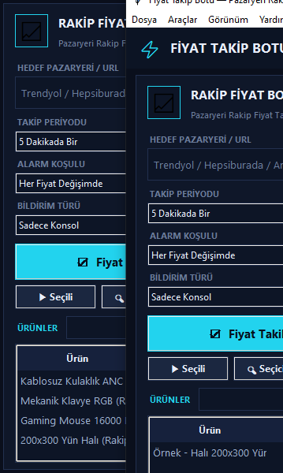

---

# 🟥 ÜST BAŞLIK BUTONLARI

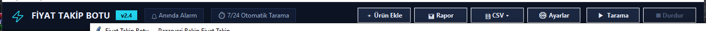

Soldan sağa:

## 1) ＋ Ürün Ekle
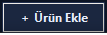

- **Ne yapar:** İzlenecek yeni bir rakip ürünü ekler.
- **Basınca ne olur:** "Yeni Ürün Ekle" penceresi açılır, 4 alan doldurulur:

| Alan | Ne yazılır | Zorunlu mu |
|---|---|---|
| **Ürün adı** | Listede görünecek isim (örn. "Xbox Kumanda") | ✅ Evet |
| **Ürün URL'si** | Pazaryeri ürün linki (trendyol/hepsiburada/amazon/n11...) | ✅ Evet |
| **CSS seçici** | Fiyatın bulunduğu HTML kodu. **Boş bırakılırsa** bot sayfayı tarayıp para birimli ilk adayı kendisi seçer | ❌ Hayır |
| **Not** | Kendi hatırlatmanız (opsiyonel) | ❌ Hayır |

- **Kaydet** → ürün listeye düşer ve `config.json`'a yazılır. **Vazgeç** → hiçbir şey olmaz.
- Aynı adda ürün zaten varsa *"Bu adda bir ürün zaten var"* uyarısı verilir (eklenmez).
- **İpucu:** Adres çubuğundaki linki kopyalayıp yapıştırmanız yeterli; alanı sol
  paneldeki `ÜRÜN ARA` kutusuna yapıştırıp **＋**'a basmak da aynı işi yapar
  (pencere ad + link dolu açılır).

## 2) 📊 Rapor
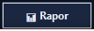

- **Ne yapar:** Doğrudan **"Rapor" sekmesine** atlar ve raporu tazeleyip getirir.
- **Basınca ne olur:** Sağ alttaki sekmelerde *Rapor* açılır; her ürün için
  kaç kayıt, ilk fiyat, son fiyat, en düşük, en yüksek, değişim % ve tarih aralığı listelenir.
- **Ne zaman:** "Bu ürünü 30 günde ne kadar takip ettim, kaça düştü?" demek istediğinizde.

## 3) 📄 CSV ▾
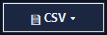

- **Ne yapar:** Açılan menüden **Excel'de açılacak dosya** indirir (`.csv`, UTF-8 — Türkçe karakter bozulmaz).
- **Menüdeki 5 seçenek:**

| Seçeneğin adı | Hangi veriyi kaydeder |
|---|---|
| Tarama Sonuçları | En son taramanın tablosu (önceki/yeni fiyat, değişim) |
| Rapor | Rapor sekmesindeki özet tablo |
| Ürün Listesi | Eklediğiniz tüm ürünler (ad, URL, seçici) |
| Fiyat Geçmişi | Seçili ürünün gün gün fiyat kayıtları |
| Rakip Radar | Radar sekmesindeki satıcı tablosu |

- **Basınca ne olur:** "Farklı Kaydet" penceresi açılır → dosyayı seçip kaydedersiniz.
- **Dikkat:** CSV Aktar'ın çalışması için ilgili sekmede **veri olması** gerekir
  (ör. Rapor CSV'si için önce "Raporu Getir" demelisiniz).

## 4) ⚙ Ayarlar
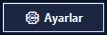

- **Ne yapar:** Telegram ve tarama ayarlarını düzenler (pencere).
- **Alanlar:**

| Alan | Açıklama |
|---|---|
| **Bot token** | Telegram botunun şifresi — `@BotFather`'a "/newbot" yazın, verdiği token'ı buraya yapıştırın |
| **Chat ID** | Mesajın gideceği sohbet — `@userinfobot`'a bir mesaj atın, size ID verir |
| **İstekler arası bekleme (sn)** | Her ürün arasında 1–30 sn bekleme (hızlı=ban riski, yavaş=gecikme). Varsayılan 3 |
| **Uyarı eşiği (%)** | 0 = her değişimde uyar. 5 yazarsanız %5 altındaki değişimlerde uyarı verilmez |

- **Kaydet** → ayarlar hemen uygulanır (Ayarlar'ı sonradan sol paneldeki
  **ALARM KOŞULU** ve **BİLDİRİM TÜRÜ** alanlarından da değiştirebilirsiniz).
- **Telegram testi** için: Araçlar menüsü → **Telegram Testi**.

## 5) ▶ Tarama
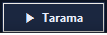

- **Ne yapar:** **Tüm ürünleri hemen bir kez tarar.**
- **Basınca ne olur:**
  1. Buton kilitlenir (soluk görünür), **■ Durdur** yanar.
  2. İlerleme çubuğu dolar, konsola satırlar düşer.
  3. Bittiğinde: sonuç tablosu dolar, kartlar güncellenir, özet yazar
     (*"4 ürün tarandı · 2 değişiklik · 1 sorun"*).
- **Tarama sırasında** tekrar basamazsınız (*"Zaten bir tarama çalışıyor"*).
- **Kısayol:** `F5`
- **Ürün yoksa:** *"Önce sol taraftan URL ile rakip ürün ekleyin"* uyarısı verir.

## 6) ■ Durdur
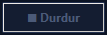

- **Ne yapar:** Devam eden taramayı **iptal eder** ve **otomatik takibi de kapatır**.
- **Basınca ne olur:** Konsola *"■ Tarama durduruluyor…"*, biten satırlar
  **DURDURULDU** rozetiyle işaretlenir, zamanlayıcı iptal olur.
- **Kısayol:** `Esc`
- Tarama yokken basmak zararsızdır (otomatik takibi kapatır).

## 🏷️ Başlıktaki iki rozet (bilgi amaçlıdır, tıklanmaz)
`🔔 Anında Alarm` ve `⏱ 7/24 Otomatik Tarama` — programın özelliklerini gösterir.
Pencere çok daralırsa otomatik gizlenirler.

---

# 🟦 SOL KONTROL PANELİ

## 7) Marka kutusu (sadece görünüm)
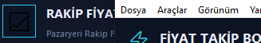
`RAKİP FİYAT BOTU v2.6` — logo ve slogan. **Tıklanmaz.**

## 8) Form alanları (4 adet)
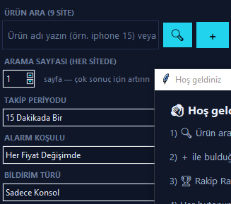

### a) 🔍 ÜRÜN ARA (9 SİTE) — kutu · 🔍 · ＋
- **Kutuya yazın:** Ürün adı (örn. *iphone 15*) → **Enter** ya da **🔍**: Trendyol, Hepsiburada, N11, Amazon, Pazarama, Etsy, eBay, AliExpress ve Çiçeksepeti'de aranır; sonuçlar **🔍 Ürün Arama** sekmesine fiyat artan sırayla düşer.
- **Link yapıştırırsanız** (http/https) **＋** o linki takip listesine ekler (pencere ad + link dolu açılır).
- Kutuya tıkladığınızda ipucu yazısı silinir, odak çıkınca geri gelir.
- **İpucu balonu:** programın ilk açılışında kısa kılavuz çıkar ("Bir daha gösterme" ile kapatılabilir); ayrıca **her butonun üstüne bir süre gelince** o butonun açıklaması görünür.

### b) TAKİP PERİYODU
Otomatik tekrar taramanın sıklığı. Seçenekler ve anlamları:

| Seçim | Ne demek |
|---|---|
| **Tek Seferlik Tarama** | Bitişte durur, tekrar etmez |
| **5 Dakikada Bir** | Bitişten 5 dk sonra kendiliğinden yeniden tarar |
| **15 Dakikada Bir** | ✅ Varsayılan — 15 dk'da bir tekrarlar |
| **30 Dakikada Bir** | 30 dk'da bir tekrarlar |
| **60 Dakikada Bir** | Saatte bir tekrarlar |

- **Değiştirince:** Hemen kaydedilir; takip **açıkken** değiştirirseniz sayaç
  yeni değerle yeniden kurulur. Durum çubuğunda *"Otomatik takip — sonraki tarama 15 dk sonra"* yazar.

### c) ALARM KOŞULU
Uyarı eşiği (Ayarlar penceresindeki "Uyarı eşiği" ile aynı):

| Seçim | Sonuç |
|---|---|
| **Her Fiyat Değişimde** | ✅ Varsayılan — %0,01'lik değişimde bile kart alarm verir |
| **%2 Üzeri Değişimde** | Sadece ≥%2 değişimlerde kartta 🔔 alarm yanar |
| **%5 Üzeri Değişimde** | Sadece ≥%5 değişimlerde |
| **%10 Üzeri Değişimde** | Sadece ≥%10 değişimlerde (büyük indirim avcıları için) |

- Eşiğin altında kalan değişim kartta gri yazar: *"○ Eşiğin altında kaldı (esik %5)"*.

### d) BİLDİRİM TÜRÜ

| Seçim | Sonuç |
|---|---|
| **Telegram & Konsol** | ✅ Varsayılan — değişiklik varsa Telegram'a mesaj + konsola not |
| **Sadece Konsol** | Telegram'a **hiçbir şey gönderilmez**, sadece konsol/rapor |

- **Telegram & Konsol** seçili ama token/chat ID girilmemişse konsolda sarı uyarı çıkar:
  *"Değişiklikler var ama Telegram ayarlanmamış (Ayarlar → Telegram)"* — program çalışmaya devam eder.

## 9) ☑ Fiyat Takibini Başlat (en büyük buton)
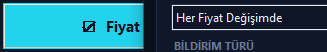

- **Ne yapar:** Programın **ana düğmesi**. İki işi birden yapar:
  1. Tüm ürünleri **hemen tarar**,
  2. **Otomatik takibi açar** (TAKİP PERİYODU'na göre kendiliğinden tekrarlar).
- **Basınca ne olur:**
  - Buton **■ Takibi Durdur** haline döner (kırmızı).
  - Konsola: *"⏱ Otomatik takip açık — 15 dakikada bir taranacak."*
  - Tarama bitince otomatik olarak sonraki tarama zamanlanır; durum çubuğunda
    geri sayım yazar.
- **Tekrar basınca:** Tarama + otomatik takip durur, buton eski haline döner.
- **Tarama sürerken basmak** da durdurur.

## 10) Alt sıra butonları: ▶ Seçili · 🔍 Seçici Bul · ⚙ Ayarlar
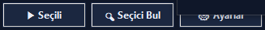

| Buton | Ne yapar | Basınca ne olur | Kısayol |
|---|---|---|---|
| **▶ Seçili** | Sadece **üstündeki tikli** ürünleri tarar | Liste kutusunda Ctrl+tıkla birkaç ürün seç → bas; seçili olmayanlara dokunulmaz | `F6` |
| **🔍 Seçici Bul** | Ürünün fiyatının **CSS kodunu** bulur (fiyat yanlış okunuyorsa) | Yeni pencere açar → **Adayları Bul** → ortaya çıkan listeden doğru satırı **çift tıkla** → "Bu Seçiciyi Kullan" de → seçici ürüne işlenir | `Ctrl+F` |
| **⚙ Ayarlar** | Üst başlıktaki ⚙ ile **aynı** pencereyi açar | Telegram/bekleme/eşik ayarları | `Ctrl+,` |

## 11) ÜRÜNLER listesi (arama + tablo)
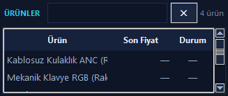

| Parça | Ne yapar |
|---|---|
| **Arama kutusu** | Yazdıkça liste anında süzülür (ada VE url'ye göre). Yanındaki **✕** süzgeci temizler |
| **`4 ürün` yazısı** | Listede kaç ürün olduğunu gösterir (filtre varsa "filtre: '...')" eklenir) |
| **Tablo başlıkları** | **Ürün** (ad) · **Son Fiyat** · **Durum** |
| **Durum renkleri** | 🔴 kırmızı = fiyat **arttı** · 🟢 yeşil = fiyat **düştü** · gri `—` = henüz taranmadı |
| **Çift tık** | Üstüne **çift tıklayınca** o ürünün düzenleme penceresi açılır (ad/URL/seçici/not değiştir → Kaydet) |
| **Tek tık** | Ürünü seçer → **Sağ paneldeki kart ve diğer sekmeler o ürüne geçer** |
| **Dikey/yatay çubuklar** | Liste sığmazsa kaydırır |

---

# 🟩 SAĞ: CANLI PANEL (Ürün kartları)

## 12) Panel başlığı
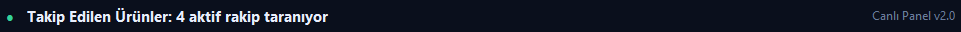
- *"Takip Edilen Ürünler: 4 aktif rakip taranıyor"* — toplam ürün sayısını söyler.
- Sağda `Canlı Panel v2.0` etiketi (dekoratif).

## 13) Kartlar (her ürün = 1 kart)
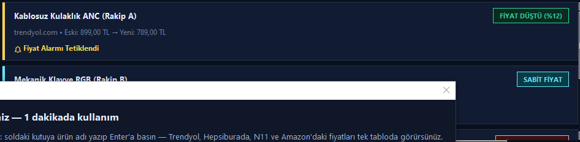
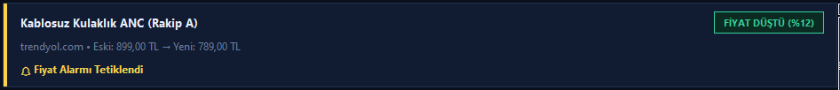

**Kartın anatomisi:**
1. **Ürün adı** (kalın beyaz)
2. **Sağ üst rozet** — durumu tek kelimeyle anlatır
3. **Gri satır:** site adı • eski fiyat → yeni fiyat
4. **Alt renkli satır:** alarm durumu

**Rozetler:**

| Rozet | Renk | Ne demek |
|---|---|---|
| `FİYAT DÜŞTÜ (%12)` | 🟢 yeşil | Fiyat düştü — fırsat! |
| `FİYAT ARTTI (+%8)` | 🔴 kırmızı | Fiyat çıktı |
| `SABİT FİYAT` | 🔵 camgöbeği | Değişiklik yok |
| `FİYAT ALINAMADI` | 🟡 sarı | Sayfadan fiyat okunamadı |
| `İLK KAYIT` | 🟣 mor | İlk kez kaydedildi (takip yeni başladı) |
| `DURDURULDU` | ⚪ gri | Tarama o üründe iptal edildi |

**Alt renkli satır:**

| Satır | Ne demek |
|---|---|
| `🔔 Fiyat Alarmı Turuncu` | Alarm koşulunu karşılayan değişim var → Telegram/konsol uyarısı tetiklendi |
| `○ Eşiğin altında kaldı (esik %5)` | Değişim var ama seçtiğiniz eşiğin altında → haber verilmez |
| `✓ Değişim Yok` | Fiyat aynı |
| `⚠ Kontrol Edilemedi` | Sayfa açılmadı / fiyat bulunamadı / engellendi |
| `✔ Takip başlatıldı` | Ürünün ilk fiyat kaydı alındı |

**Kartlarla yapılanlar:**

| Hareket | Sonuç |
|---|---|
| **Tıkla** | O ürün sol listede seçilir (diğer sekmeler de ona geçer) |
| **Çift tıkla** | Ürünün pazaryeri sayfası **tarayıcıda açılır** |
| **Fare tekerleği** | Kartlar yukarı/aşağı kaydırılır (kart sayısı sığmazsa) |

---

# 🟨 SEKMELER (sağ alt)

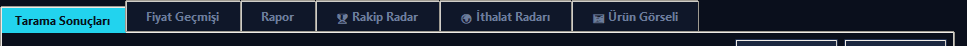

## 14) 🔵 Tarama Sonuçları (varsayılan sekme)

- **Üstteki özet:** *"4 ürün tarandı · 2 değişiklik · 1 sorun"*
- **CSV Aktar** → sonuç tablosunu Excel'e yazar (bkz. buton 3).
- **Temizle** → tabloyu ve özeti boşaltır (*"Temizlendi."*).

| Sütun | Anlamı |
|---|---|
| Ürün | Ürün adı |
| Önceki | Bir önceki fiyat |
| Yeni | Yeni okunan fiyat |
| Değişim | % değişim (↓ yeşil / ↑ kırmızı) |
| Durum | `DEĞİŞTİ` · `DEĞİŞMEDİ` · `İLK` · `BULUNAMADI` · `HATA` |
| Mesaj | Kısa açıklama |

**Satır renkleri:** kırmızı zemin = değişen ürün · sarı yazı = sorunlu ürün ·
camgöbeği yazı = ilk kayıt.

## 15) 🔍 Ürün Arama (9 pazaryeri)

Ürün adını yazdığınızda **Trendyol, Hepsiburada, N11, Amazon, Pazarama,
Etsy, eBay, AliExpress ve Çiçeksepeti**'nde aranır;
sonuçlar **fiyat artan sırayla** bu sekmeye düşer.

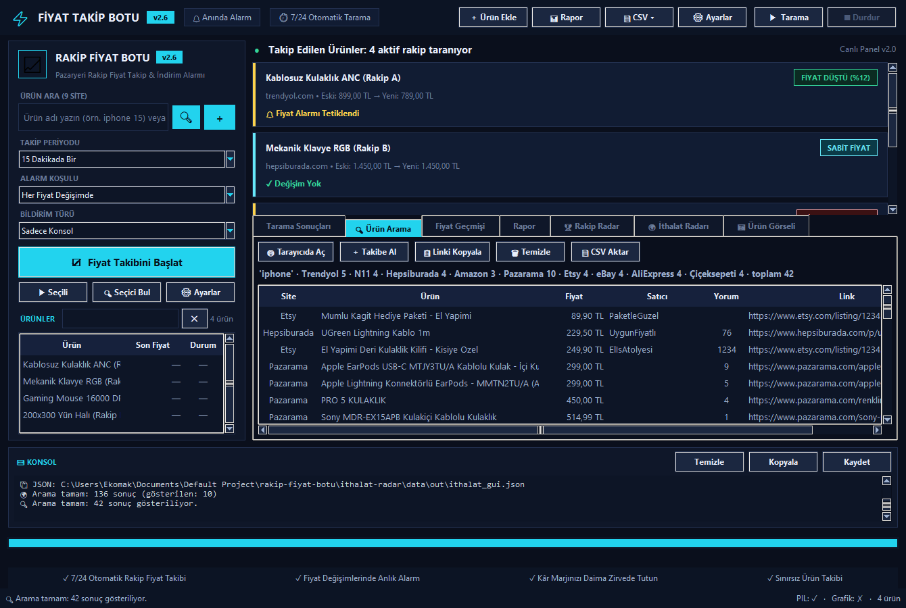

**Site durumları** (özet satırında ✗ görünen siteler):

| Site | Durum |
|---|---|
| Trendyol · N11 · Hepsiburada · Amazon · Pazarama | ✅ Çalışıyor |
| eBay · AliExpress · Çiçeksepeti | 🚧 Ağ güvenliği duvarı engelliyor — **VPN ile açılır** (açıkken ✗ yerine sonuç gelir) |
| Etsy | 🚧 Bot doğrulaması (captcha) gösterebilir — VPN/farklı IP ile deneyin |

- Arama kutusu **sol panelde** (Enter ya da 🔍).
- Özet satırında site başına sonuç sayısı görünür; erişilemeyen site ✗ ile işaretlenir.
- Farklı para birimli ürünler (eBay/AliExpress: USD) ayrı grupta, para birimiyle gösterilir.

| Buton | Ne yapar |
|---|---|
| **🌐 Tarayıcıda Aç** | Seçili ürünün sayfasını tarayıcıda açar |
| **＋ Takibe Al** | Seçili ürünü takip listesine ekler (ad + link hazır gelir) |
| **📋 Linki Kopyala** | Ürün linkini panoya kopyalar |
| **🗑 Temizle** | Sonuçları siler |
| **📄 CSV Aktar** | Sonuç tablosunu CSV yapar |

**Çift tık:** satıra çift tıklayınca o ürün tarayıcıda açılır.

## 16) 🟢 Fiyat Geçmişi

- **Önce soldaki listeden bir ürün seçin** → o ürünün gün gün fiyatları tabloya düşer,
  sağdaki alanada **grafik** çizilir.
- **Butonlar:**

| Buton | Ne yapar |
|---|---|
| **CSV Aktar** | Geçmişi `.csv` yapar |
| **Grafiği Yenile** | Grafiği yeniden çizer (grafik kutusunda ✗ görürseniz matplotlib kurulu değil demektir — grafik hariç her şey çalışır) |

- **Not:** En az **2 fiyat kaydı** olmalı (ilk taramadan sonra grafiğe düşer).

## 17) 🟠 Rapor

- **Üst satır:** `Son [30] gün` — kutuya gün yazın (7–365).

| Buton | Ne yapar |
|---|---|
| **Raporu Getir** | Seçili güne kadar özet tabloyu doldurur |
| **CSV Aktar** | Raporu `.csv` yapar (önce "Raporu Getir" deyin) |

| Sütun | Anlamı |
|---|---|
| Kayıt | Kaç günlük veri var |
| İlk / Son | Dönemin ilk ve son fiyatı |
| En Düşük / En Yüksek | Dönem min–maks |
| Değişim | İlk → son yüzde farkı |
| Aralık | Tarih aralığı |

**Renkler:** kırmızı yazı = fiyat artmış · yeşil yazı = fiyat düşmüş.

## 18) 🏆 Rakip Radar

Rakip satıcıların **kim, kaça, kaç yorumla** sattığını gösterir (tahmini veriler).

| Parça | Ne yapar |
|---|---|
| **Sorgu** | Aranacak ürün adı (örn. *"iphone 15 kılıf"*) |
| **Platform onay kutuları** | trendyol / n11 / hepsiburada — hangileri taranacak |
| **Sayfa (1–5)** | Her platformda kaç sayfa taranacak |
| **▶ Radar Taraması** | Taramayı başlatır (arka planda çalışır) |
| **■ Durdur** | Radarı iptal eder |
| **📄 Raporu Aç** | Radar özet raporunu metin olarak açar |
| **CSV Aktar** | Satıcı tablosunu `.csv` yapar |

Tabloda öne çıkan satır **lider satıcıdır** (koyu zemin + camgöbeği yazı).
Alt satırda konsol gibi özet yazısı çıkar. `F7` kısayolu da bu sekmeyi başlatır.

## 19) 🌍 İthalat Radarı

Rakibinin **nereden mal aldığını** keşfeder — ABD denizyolu ithalat kayıtları
(ImportYeti verisi) üzerinden tedarikçi ve müşteri listesi çıkarır.

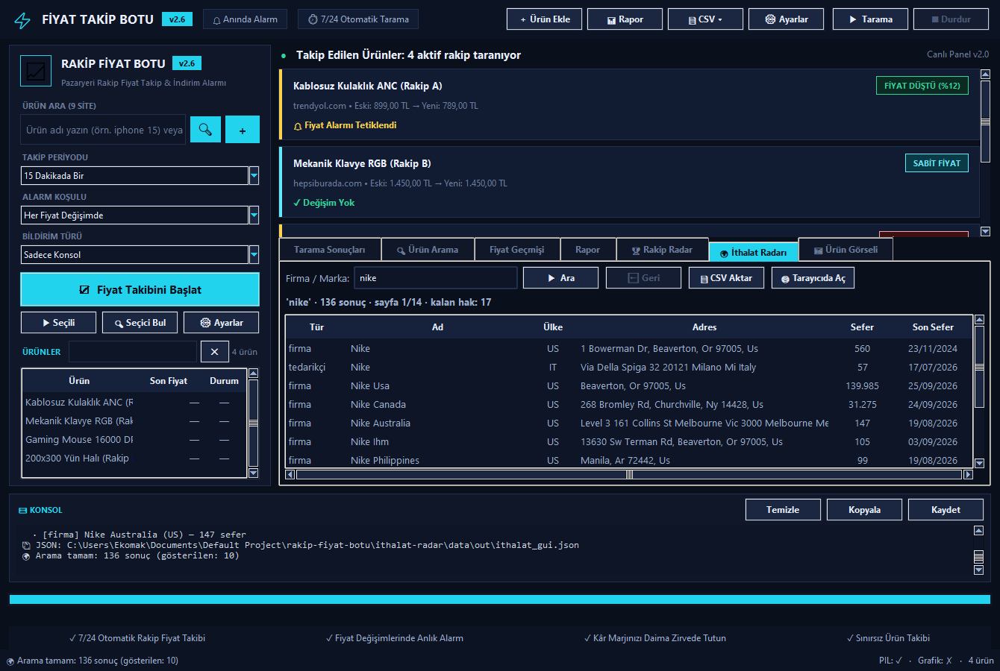

| Parça | Ne yapar |
|---|---|
| **Firma / Marka** | Aranacak firma adı (örn. *"nike"*) — Enter da çalışır |
| **▶ Ara** | Aramayı başlatır; sonuçlar tabloya düşer |
| **⬅ Geri** | Bir önceki görüntüye döner (arama ↔ detay geçmişi) |
| **📄 CSV Aktar** | Listeyi `.csv` yapar (Araçlar menüsündeki CSV menüsüne de eklendi) |
| **🌐 Tarayıcıda Aç** | Aynı aramayı/sayfayı tarayıcıda importyeti.com'da açar |
| **Çift tık** | Satıra çift tık → o firmanın tedarikçileri (veya müşterileri) açılır |

**Sütunlar (arama):** Tür (firma/müşteri) · Ad · Ülke · Adres · Sefer · Son Sefer.
**Sütunlar (detay):** Bağlantı · Ülke · Sefer · Ürün Grupları.
Özet satırında toplam sonuç, API hakkı ve en yoğun ülkeler görünür.

## 20) 🖼 Ürün Görseli

Seçili ürünün **sayfa görselini + fiyatını birlikte** gösterir (sahte tıklama/hile kontrolü için).

| Buton | Ne yapar |
|---|---|
| **🔄 Görseli Getir** | Seçili ürünün görsellerini indirir ve ilki gösterilir |
| **➡ Sonraki / ⬅ Önceki** | Görseller arasında gezinir |
| **🌐 Tarayıcıda Aç** | Ürün sayfasını tarayıcıda açar |
| **Görsel listesi** | İndirilen görsellerin listesi — satıra tıklayınca o görsel gösterilir |

*Soldaki listeden ürün seçmeyi unutmayın.*

---

# 🟨 ALT ŞERİT

## 21) 📟 KONSOL
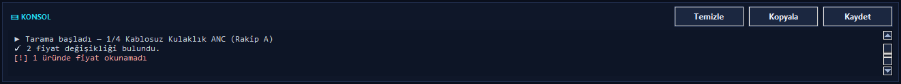

Her şeyin canlı kaydı. Renk kodları:

| Renk | Anlamı | Örnek |
|---|---|---|
| 🔴 kırmızı | **Hata** | `[!] 1 üründe fiyat okunamadı` |
| 🟢 yeşil | **Başarı** | `✅ 2 fiyat değişikliği bulundu` |
| 🟡 sarı | **Uyarı** | `⚠ Değişiklikler var ama Telegram ayarlanmamış` |
| 🔵 mavi | **Bilgi** | `📊 4 ürün tarandı • ...` |
| ⚪ gri | **Normal** | `▶ Tarama başladı` |

| Buton | Ne yapar |
|---|---|
| **Temizle** | Konsolu boşaltır |
| **Kopyala** | Tüm yazılanları panoya kopyalar |
| **Kaydet** | Konsolu `.txt` dosyasına yazar (destek isteyince gönderin) |

## 22) İlerleme çubuğu
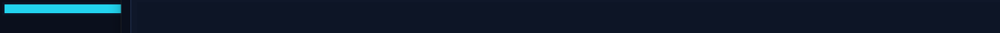
Tarama sırasında dolar (`1/4`, `2/4`…). Bittiğinde %100 olur, beklemede boştur.

## 23) Onay şeridi (dekoratif)

`✓ 7/24 Otomatik Rakip Fiyat Takibi` · `✓ Fiyat Değişimlerinde Anlık Alarm` ·
`✓ Kâr Marjını Daima Zirvede Tutun` · `✓ Sınırsız Ürün Takibi` — özellik listesi, **tıklanmaz**.

## 24) Durum çubuğu
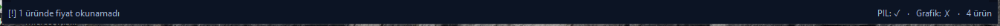

| Kısım | Ne gösterir |
|---|---|
| **Sol** | Son olay: *"Takip periyodu: 15 Dakikada Bir"*, *"Otomatik takip — sonraki tarama 15 dk sonra"* vb. |
| **Sağ — PIL: ✓/✗** | Pillow kurulu mu? (✗ ise **Ürün Görseli** çalışmaz, diğer her şey çalışır) |
| **Sağ — Grafik: ✓/✗** | Matplotlib kurulu mu? (✗ ise **grafik çizilmez**, tablolar çalışır) |
| **Sağ — 4 ürün** | Toplam ürün sayısı |

---

## 25) 🔑 Lisans / Deneme Sınırı

| Kısım | Ne işe yarar |
|---|---|
| **Deneme hakkı** | Kurulumdan sonra **5 sorgu** hakkınız vardır: Ürün Arama sorguları, elle başlattığınız taramalar ve İthalat Radarı aramaları sayılır |
| **Sınır dolunca** | **"Lisans Gerekli"** penceresi açılır — geçerli anahtar girilene kadar işlem başlamaz |
| **Lisans penceresi** | `RN1-…` biçimindeki anahtarı yazıp **Doğrula**: `config.json` → `lisans` alanına kaydedilir ve kalıcı olarak açılır |
| **Menü** | **Araçlar → Lisans…** — kalan hak durumunu gösterir, anahtar girmeyi sağlar |
| **Otomatik takip** | Kendiliğinden başlayan tekrar taramalar **hak yemez** — yalnızca elle başlattıklarınız sayılır |
| **Sayaç dosyası** | `data/limit.json` (yalnızca bilgisayarınızda tutulur, git'e girmez) |
| **Üretim** | Anahtarlar satıcı tarafından `python lisans_uret.py` ile üretilir |

> Kilit penceresi görseli bu rehberde yoktur; açılışta ve sınır dolduğunda
> konsolda kalan hak sayısı yazılır.

---

# 📋 MENÜ ÇUBUĞU (pencerenin en üstündeki yazılar)

| Menü | Komutlar ve anlamları |
|---|---|
| **Dosya** | `Config Aç…` ayar dosyasını seç · `Config Farklı Kaydet…` yedekle · `Ürün Listesini CSV Aktar…` · `Tarama Sonuçlarını CSV Aktar…` · `Raporu CSV Aktar…` · `Çıkış` |
| **Araçlar** | `Tümünü Tara` (= ▶ Tarama) · `Seçili Ürünleri Tara` (= ▶ Seçili) · `Durdur` · `Radar Taraması` · `Radar Sekmesine Git` · `Seçici Bul…` · `Telegram Testi` (boş mesaj gönderip token'ı dener) · `Ayarlar…` · `Lisans…` (deneme hakkı durumu + anahtar girme) · `Görev Zamanlayıcıya Ekle (Windows)` (program kapalıyken bile saatli çalışsın) · `Config Klasörünü Aç` |
| **Görünüm** | `Konsolu Temizle` · `Fiyat Geçmişini Yenile` · `Raporu Yenile` |
| **Yardım** | `Hakkında` · `Kullanım Kılavuzu` |

---

# ⌨️ KLAVYE KISAYOLLARI

| Tuş | Yapar |
|---|---|
| `F5` | Tümünü tara |
| `F6` | Seçili ürünleri tara |
| `F7` | Rakip Radar taraması başlat |
| `Esc` | Taramayı / otomatik takibi durdur |
| `Ctrl+O` | Config dosyası aç |
| `Ctrl+,` | Ayarlar penceresi |
| `Ctrl+F` | Seçici Bul |

---

# 🚀 5 ADIMDA İLK KURULUM

1. **Ürün ekle** — `＋ Ürün Ekle` → ad + link → **Kaydet** (ya da linki sol URL kutusuna yapıştırıp **＋**).
2. **Ayarla** — Sol panelde `TAKİP PERİYODU` (örn. 15 Dakikada Bir) ve `ALARM KOŞULU` seç.
3. **(İsteğe bağlı) Telegram** — `⚙ Ayarlar` → token + Chat ID → **Kaydet** → Araçlar → **Telegram Testi**.
4. **Başlat** — Büyük `☑ Fiyat Takibini Başlat` butonuna bas: tarama hemen başlar,
   bitince kendisi tekrarlar.
5. **İzle** — Sağdaki kartları, `Tarama Sonuçları` sekmesini ve konsolu takip et.
   Rapor için `📊 Rapor`, Excel için `📄 CSV ▾`.

---

# ❓ SIK KARŞILAŞILAN DURUMLAR

| Durum | Ne anlama geliyor / ne yapmalı |
|---|---|
| *"Önce sol taraftan URL ile rakip ürün ekleyin"* | Hiç ürün yok — `＋ Ürün Ekle` |
| *"Zaten bir tarama çalışıyor. Önce durdurun."* | `■ Durdur`'a basın, sonra tekrar deneyin |
| *"Bu adda bir ürün zaten var"* | Farklı bir ad yazın |
| Kartta `FİYAT ALINAMADI` + `⚠ Kontrol Edilemedi` | Sayfa botu engellemiş olabilir: **🔍 Seçici Bul** ile doğru seçiciyi verin, `Ayarlar → bekleme` süresini yükseltin (örn. 5 sn) |
| `Telegram ayarlanmamış` uyarısı | `⚙ Ayarlar` → token + Chat ID; ya da `BİLDİRİM TÜRÜ = Sadece Konsol` seçin |
| Durum çubuğunda `PIL: ✗` | `pip install pillow` → Ürün Görseli düzelir |
| Durum çubuğunda `Grafik: ✗` | `pip install matplotlib` → grafik çizilir |
| Programı kapattım, takip durdu | Otomatik takip program açıkken çalışır; **Araçlar → Görev Zamanlayıcıya Ekle** ile Windows'a saatli görev olarak ekleyin |
| Tarama çok yavaş | `⚙ Ayarlar → İstekler arası bekleme`'yi düşürün (riskli) |
| Radar: "Radar tamamlanamadı (kod 2)" | Konsola bakın: "bağlantı hatası/TLS" yazıyorsa **ağ güvenliği duvarı** pazaryerlerini engelliyordur (tarayıcıda da açılmıyorsa VPN/ağ yöneticisi gerekir); "ürün kartı bulunamadı" yazıyorsa sayfa yapısı değişmiştir |
| İthalat Radarı: "Tamamlanamadı (kod 2)" | Konsola bakın: "bağlantı/TLS" hatasıysa **importyeti.com engelliyordur** (VPN deneyin); "JSON değil" yazıyorsa site tasarımı değişmiş olabilir. Sonuç tablosu boşsa o isimle kayıt yoktur — İngilizce isim deneyin (*nike*, *IKEA*) |
| Ürün Araması'nda site ✗ | eBay/AliExpress/Çiçeksepeti → güvenlik duvarı engeli, **VPN ile açılır**; Etsy → captcha, tekrar deneyin/VPN; diğer siteler etkilenmez |
| **"Lisans Gerekli"** penceresi açıldı | Deneme hakkınız doldu (5 sorgu) — `RN1-…` anahtarı girip **Doğrula**'ya basın (menü: `Araçlar → Lisans…`) |
| CSV Excel'de bozuk açılıyor | Sorun yok — dosyalar UTF-8 (BOM) ile yazılır; yine de bozuksa Excel'de "Veri → Metinden" ile açın |

---

*Rehber, programın v2.6 arayüzüne göre hazırlanmıştır. Görseller:
[`docs/rehber/`](docs/rehber/) klasöründedir.*
